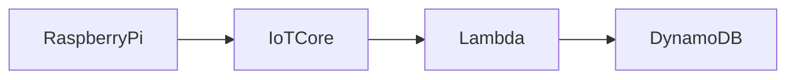
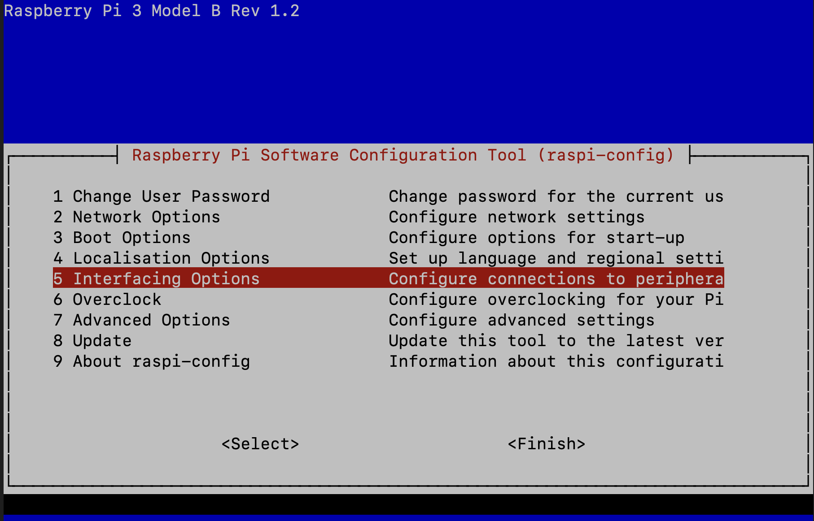
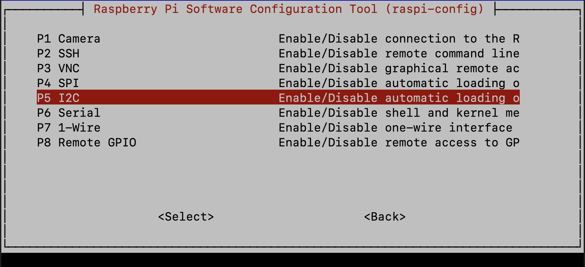
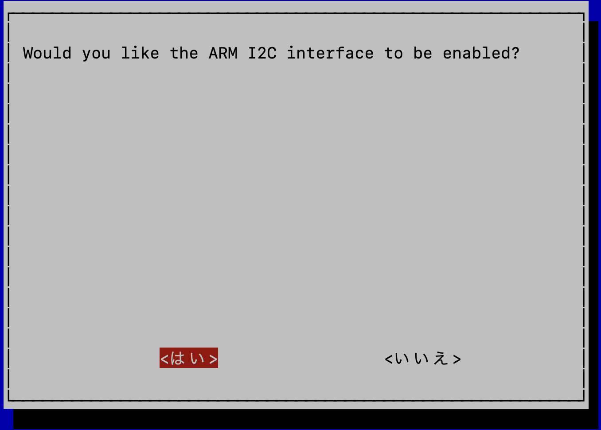
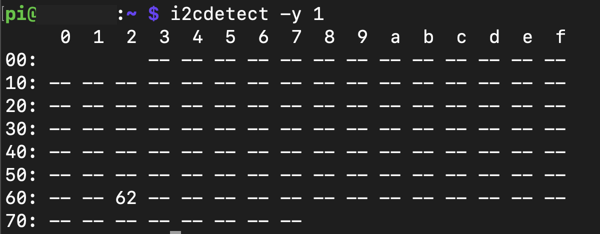
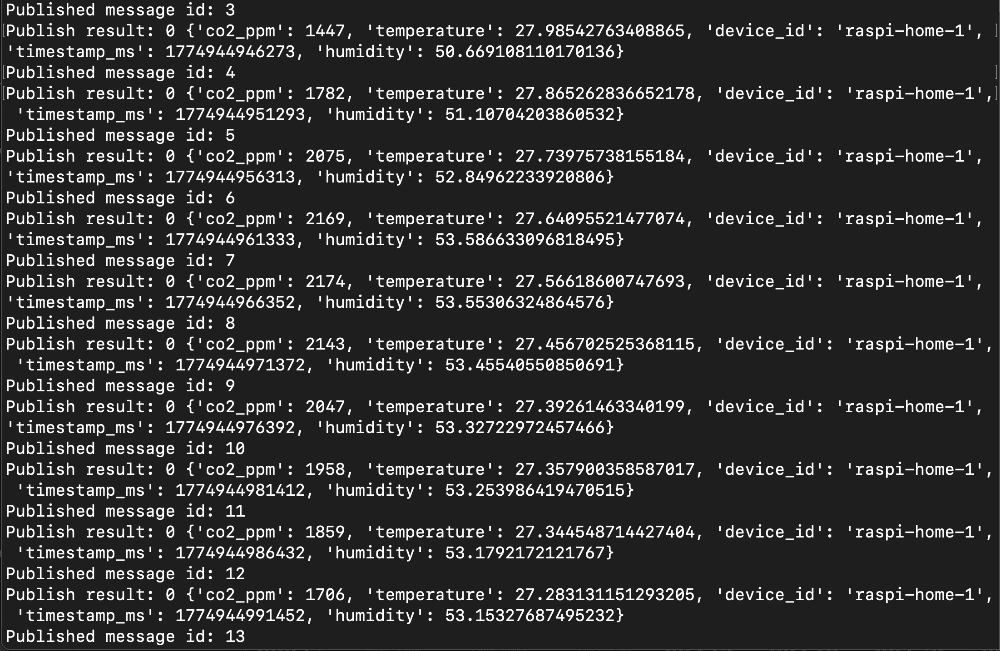
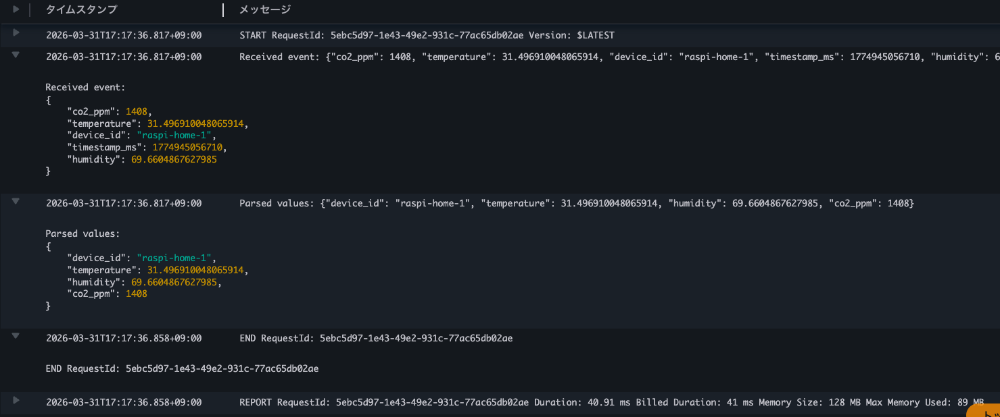
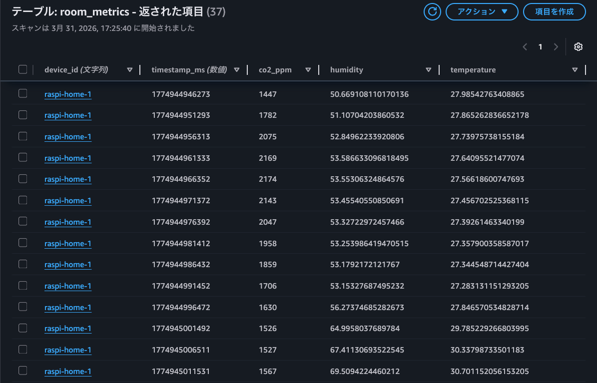

# SCD40 センサー接続・MQTT送信手順書

- [SCD40 センサー接続・MQTT送信手順書](#scd40-センサー接続mqtt送信手順書)
- [目的](#目的)
- [構成概要](#構成概要)
- [Step1. ラズパイとセンサーモジュールの配線](#step1-ラズパイとセンサーモジュールの配線)
- [Step2. ラズパイの I2C 有効化](#step2-ラズパイの-i2c-有効化)
- [Step3. センサー認識確認](#step3-センサー認識確認)
- [Step4. Pythonスクリプト作成（センサー値の取得、MQTT publish）](#step4-pythonスクリプト作成センサー値の取得mqtt-publish)
- [Step5. スクリプトの実行](#step5-スクリプトの実行)
- [Step6. Lambda / DynamoDB で受信確認](#step6-lambda--dynamodb-で受信確認)
- [次のステップ](#次のステップ)

------------------------------------------------------------------------

# 目的
SCD40 センサーモジュールをラズパイに接続し、  
取得した CO2・温度・湿度データを MQTT で AWS IoT Core に送信する  

------------------------------------------------------------------------

# 構成概要

※ Raspberry Pi 3 Model B V1.2 使用

------------------------------------------------------------------------

# Step1. ラズパイとセンサーモジュールの配線
使用モジュール：  
https://akizukidenshi.com/catalog/g/g117851/

SCD40 は I2C 接続とし、ピンの対応は以下の表の通り  
※ I2C は 2本の信号線（SDA / SCL）でデバイスと通信する仕組み  

| SCD40 | Raspberry Pi |
|------------------------------------------------------------------------|------------------------------------------------------------------------|
| VCC | 3.3V（Pin1） |
| GND | GND（Pin6） |
| SDA | GPIO2（Pin3） |
| SCL | GPIO3（Pin5） |

配線をするとこんな感じになる  


------------------------------------------------------------------------

# Step2. ラズパイの I2C 有効化
以下のコマンドからラズパイの設定画面を開き、**Interface Options** を選択する  
```bash
sudo raspi-config
```


**I2C** を選択する 


**はい** を選択し、I2C を有効化する


**Finish** を選択し、ラズパイを再起動する  
```bash
sudo reboot
```

------------------------------------------------------------------------

# Step3. センサー認識確認
I2C ツールを入れて、センサーの認識確認をする
```bash
sudo apt update
sudo apt install -y i2c-tools
i2cdetect -y 1
```

## 確認内容
`0x62` が見えれば OK（SCD40 を認識できている）


------------------------------------------------------------------------

# Step4. Pythonスクリプト作成（センサー値の取得、MQTT publish）
I2C 通信用ライブラリをインストールする  
```bash
pip3 install --user smbus2
```

## scd40_publisher.py 
以前作成した MQTT 送信スクリプトをベースに、  
I2C 経由でセンサー値を取得し、変換処理を追加したスクリプトを作成する  
※ MQTT は軽量な publish/subscribe 型の通信プロトコルで、IoTデバイスとの連携に適している  

```python
import json
import ssl
import time
import paho.mqtt.client as mqtt
from smbus2 import SMBus, i2c_msg

# エンドポイントはコンソールから確認する
ENDPOINT = "a1hfmham2ql5ac-ats.iot.ap-northeast-1.amazonaws.com"
PORT = 8883
CLIENT_ID = "raspi-home-1"
# トピック名
TOPIC = "wellness/device/raspi-home-1/telemetry"

# ダウンロードした証明書ファイル名が異なる場合は、ファイル名に合わせて変更すること
CA_PATH = "AmazonRootCA1.pem"
CERT_PATH = "certificate.pem.crt"
KEY_PATH = "private.pem.key"

I2C_ADDR = 0x62
bus = SMBus(1)

def on_connect(client, userdata, flags, rc):
    print("Connected with result code:", rc)

def on_publish(client, userdata, mid):
    print("Published message id:", mid)

# SCD40 に命令を送信
def send_command(command: int) -> None:
    msb = (command >> 8) & 0xFF
    lsb = command & 0xFF
    msg = i2c_msg.write(I2C_ADDR, [msb, lsb])
    bus.i2c_rdwr(msg)

# SCD40 から返ってきた生データをバイト列で読み込む
def read_bytes(length: int) -> bytes:
    msg = i2c_msg.read(I2C_ADDR, length)
    bus.i2c_rdwr(msg)
    return bytes(msg)

# 受信データの破損を確認するための CRC を計算
def calc_crc(data: bytes) -> int:
    crc = 0xFF
    for byte in data:
        crc ^= byte
        for _ in range(8):
            if crc & 0x80:
                crc = ((crc << 1) ^ 0x31) & 0xFF
            else:
                crc = (crc << 1) & 0xFF
    return crc

# 2バイトの値を取り出して CRC チェックし、整数として取り出す
def parse_word_with_crc(raw: bytes, offset: int) -> int:
    word = raw[offset:offset + 2]
    crc = raw[offset + 2]
    if calc_crc(word) != crc:
        raise ValueError("CRC mismatch at offset {}".format(offset))
    return (word[0] << 8) | word[1]

def start_periodic_measurement():
    # 0x21B1: 測定開始（SCD40のコマンド仕様に基づく）
    send_command(0x21B1)
    # 初回測定が安定するまで待機
    time.sleep(5)

# センサー値の読み取り
def read_measurement():
    # 0xEC05: 測定結果の取得（SCD40のコマンド仕様に基づく）
    send_command(0xEC05)
    time.sleep(0.01)

    # CO2, temp, humidity が各2byte + CRC1byte = 9 bytes
    raw = read_bytes(9)

    co2_raw = parse_word_with_crc(raw, 0)
    temp_raw = parse_word_with_crc(raw, 3)
    hum_raw = parse_word_with_crc(raw, 6)

    # 正規化 & スケール変換 & オフセット
    temperature = -45 + 175 * (temp_raw / 65535.0) # -45 ～ +130 ℃
    humidity = 100 * (hum_raw / 65535.0) # 0 ~ 100 %

    return co2_raw, temperature, humidity


client = mqtt.Client(client_id=CLIENT_ID)
client.on_connect = on_connect
client.on_publish = on_publish

client.tls_set(
    ca_certs=CA_PATH,
    certfile=CERT_PATH,
    keyfile=KEY_PATH,
    cert_reqs=ssl.CERT_REQUIRED,
    tls_version=ssl.PROTOCOL_TLSv1_2,
)

client.connect(ENDPOINT, PORT, keepalive=60)
client.loop_start()

start_periodic_measurement()

while True:
    # センサーの測定値をペイロードとして publish
    co2, temp, hum = read_measurement()

    payload = {
        "device_id": "raspi-home-1",
        "timestamp_ms": int(time.time() * 1000),
        "temperature": round(temp, 2), # 小数点二桁
        "humidity": round(hum, 2),     # 小数点二桁
        "co2_ppm": int(co2),
    }

    result = client.publish(TOPIC, json.dumps(payload), qos=1)
    print("Publish result:", result.rc, payload)
    time.sleep(5)
```

## 設計ポイント
- SCD40 は生データ（16bit）を返すため、スケーリング処理が必要
- CRC による通信データの整合性チェック（破損検知）を行う
- 変換式はデータシート記載のスケーリング式に基づく
- 温度は摂氏、湿度は % に変換している
- MQTT を利用して AWS IoT Core にデータ送信

------------------------------------------------------------------------

# Step5. スクリプトの実行
作成したスクリプトをラズパイ上で実行する  
```bash
python3 scd40_publisher.py
```
センサーで測定したデータが流れてくれば成功  
→ **測定中にセンサーに息を吹きかけたり、手で握っているので値が変化していることが分かる**


------------------------------------------------------------------------

# Step6. Lambda / DynamoDB で受信確認

## CloudWatch Logs
`IngestLambda` のログにセンサーデータが表示されていることが確認できる  


## DynamoDB
`room_metrics` テーブルに時系列データとして、センサーデータが登録されていることが確認できる
- device_id
- timestamp_ms
- humidity
- co2_ppm
- temperature



以上より、ラズパイとセンサーの接続 & センサー値の IoT Core 送信ができていることを確認できた  

------------------------------------------------------------------------

# 次のステップ
- Grafana でのデータ可視化
- AI Agent による健康アドバイス生成
- LINE 通知連携

------------------------------------------------------------------------
