# IoT Core - ラズパイ 接続手順書

- [IoT Core - ラズパイ 接続手順書](#iot-core---ラズパイ-接続手順書)
- [目的](#目的)
- [構成概要](#構成概要)
- [前提](#前提)
- [注意事項](#注意事項)
- [Step1. IoT Thing の作成](#step1-iot-thing-の作成)
- [Step2. IoT Core エンドポイント確認](#step2-iot-core-エンドポイント確認)
- [Step3. Python環境セットアップ](#step3-python環境セットアップ)
- [Step4. MQTT送信スクリプト作成（動作確認用）](#step4-mqtt送信スクリプト作成動作確認用)
- [Step5. ファイル転送](#step5-ファイル転送)
- [Step6. スクリプトの実行](#step6-スクリプトの実行)
- [Step7. 結果確認](#step7-結果確認)

---

# 目的
ラズパイから IoT Core に対して以下のようなダミーデータを送信し、  
データの疎通と後続処理の動作確認を実施する
```json
{
  "device_id": "raspi-home-1",
  "timestamp_ms": 1711958400000,
  "temperature": 25.0,
  "humidity": 40.0,
  "co2_ppm": 500
}
```

------------------------------------------------------------------------

# 構成概要
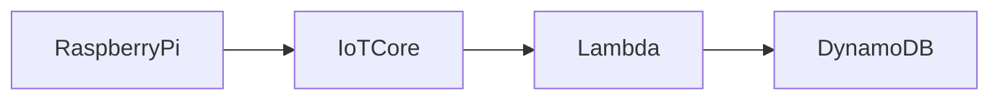
※ Raspberry Pi 3 Model B V1.2 使用

------------------------------------------------------------------------

# 前提
CDKをデプロイして **トピックルールの作成** が完了していること  
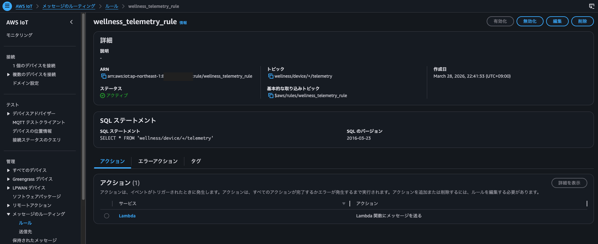

------------------------------------------------------------------------

# 注意事項
- 証明書・秘密鍵は絶対に公開しないこと
- 本手順は検証用のためポリシーの権限を強めに設定している

------------------------------------------------------------------------

# Step1. IoT Thing の作成
※ このステップはコンソールで実施する

左のメニューから **管理 > すべてのデバイス > モノ** を選択し、  
**モノを作成** をクリックする  
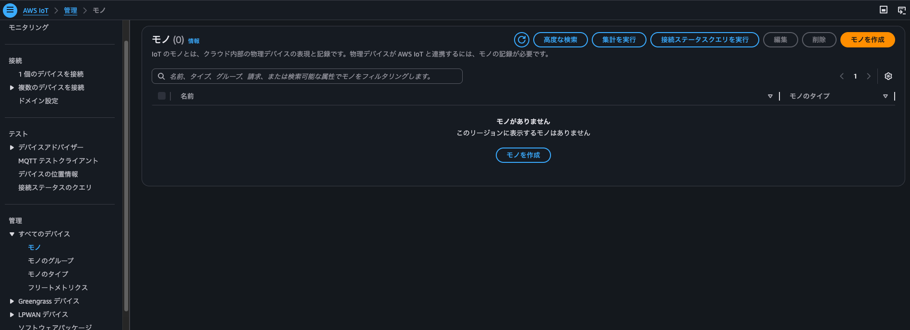

**モノのプロパティを指定** から **モノの名前** を入力する  
モノの名前（例）: raspi-home-1  

※ このモノ名（device_id）は MQTT トピック wellness/device/<device_id>/telemetry と対応する  
（例）raspi-home-1 → wellness/device/raspi-home-1/telemetry  

他の項目はデフォルトで **次へ** をクリックする  
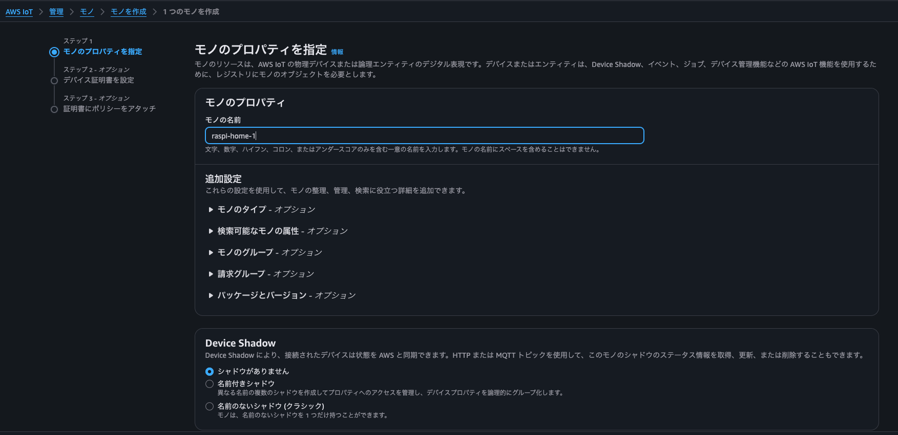

**デバイス証明書を設定** から **新しい証明書を自動生成（推奨）** を選択して **次へ** をクリックする    
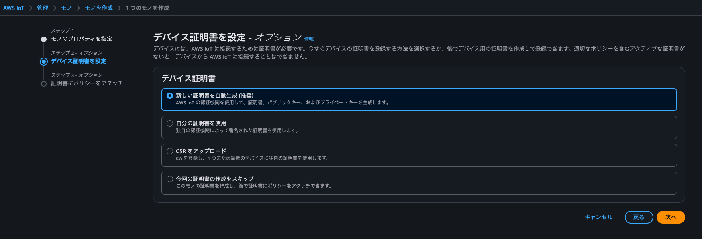

**証明書にポリシーをアタッチ** から **ポリシーを作成** をクリックする  
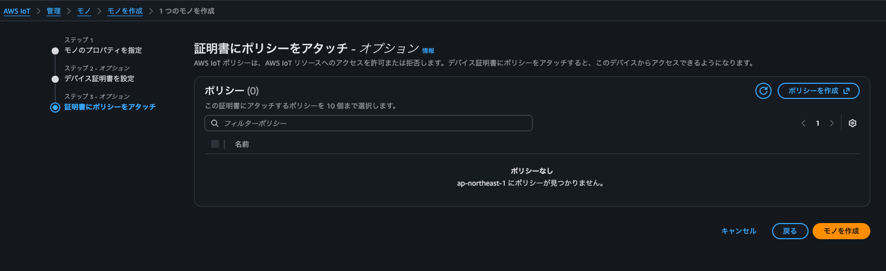

**ポリシーを作成** から **ポリシー名** と **ポリシードキュメント** を入力してポリシーを作成する  
ポリシー名（例）: raspi-iot-policy    
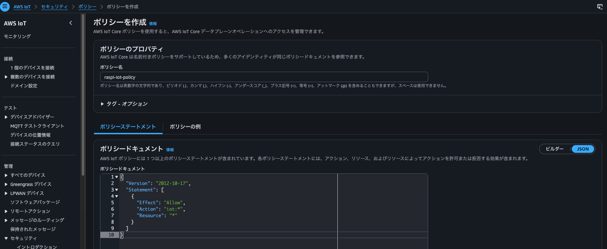

ポリシードキュメントは以下の内容としている  
```JSON
{
  "Version": "2012-10-17",
  "Statement": [
    {
      "Effect": "Allow",
      "Action": "iot:*",
      "Resource": "*"
    }
  ]
}
```
→ この証明書を持つデバイスが MQTT publish / subscribe を含む IoT Core のすべての操作を実行できる  
※ 本ポリシーは検証用のため強い権限を付与しているが、本番環境では必要最小限の権限に絞ること  

作成したポリシーを証明書にアタッチして **モノを作成** をクリックする  
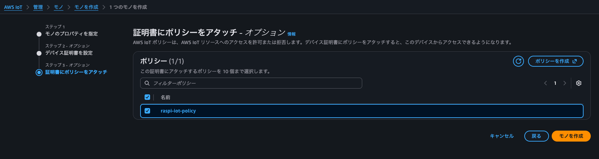

**証明書とキーをダウンロード** の画面が表示されるので、以下をダウンロードする  
- デバイス証明書（xxx-certificate.pem.crt）
- プライベートキーファイル（xxx-private.pem.key）
- Amazon 信頼サービスエンドポイント（AmazonRootCA1.pem）

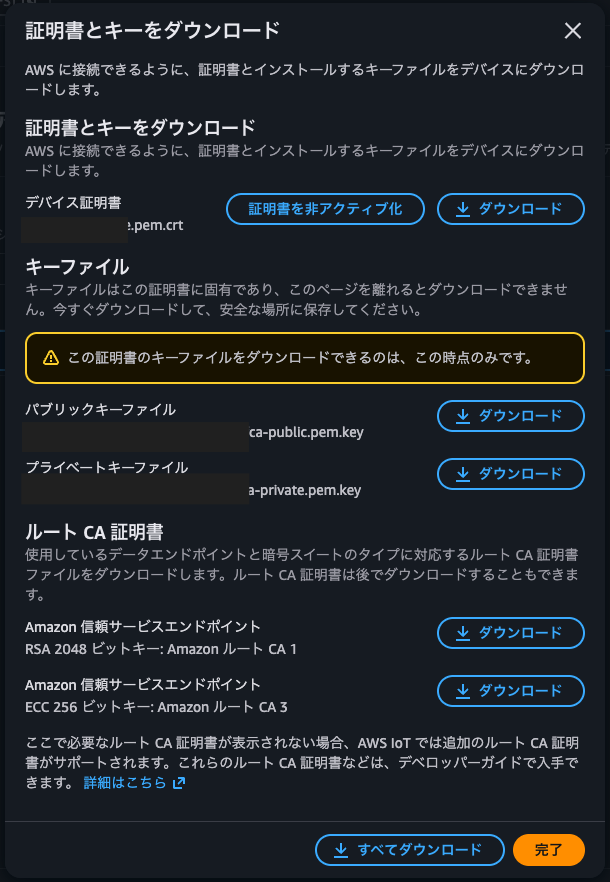

※ これらのファイルは **再DLできない** ため必ず保存すること  

------------------------------------------------------------------------

# Step2. IoT Core エンドポイント確認
左のメニューから **接続 > ドメイン設定 > iot:Data-ATS** を選択し、**ドメイン名** を記録しておく  
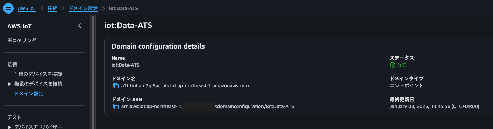

※ このエンドポイントは、ラズパイから IoT Core への MQTT 接続をする際に使用する  

------------------------------------------------------------------------

# Step3. Python環境セットアップ
ラズパイの環境をセットアップする  
``` bash
ssh pi@<ラズパイのIP> # ラズパイログイン
sudo apt update
sudo apt install -y python3-pip
pip3 install --user "paho-mqtt<2"
```
※ 自環境のラズパイの Pythonバージョンが 3.5 のため、AWSIoTPythonSDK の代わりに paho を使用している  
（AWSIoTPythonSDK は Python 3.6 以上が必要）

------------------------------------------------------------------------

# Step4. MQTT送信スクリプト作成（動作確認用）
ダミー payload 送信用スクリプトを作成する　　
### iot_test.py
``` python
import json
import ssl
import time
import paho.mqtt.client as mqtt

# エンドポイントはコンソールから確認する
ENDPOINT = "a1hfmham2ql5ac-ats.iot.ap-northeast-1.amazonaws.com"
PORT = 8883
CLIENT_ID = "raspi-home-1"
# トピック名
TOPIC = "wellness/device/raspi-home-1/telemetry"

# ダウンロードした証明書ファイル名が異なる場合は、ファイル名に合わせて変更すること
CA_PATH = "AmazonRootCA1.pem"
CERT_PATH = "certificate.pem.crt"
KEY_PATH = "private.pem.key"

def on_connect(client, userdata, flags, rc):
    print("Connected with result code:", rc)

def on_publish(client, userdata, mid):
    print("Published message id:", mid)

client = mqtt.Client(client_id=CLIENT_ID)
client.on_connect = on_connect
client.on_publish = on_publish

client.tls_set(
    ca_certs=CA_PATH,
    certfile=CERT_PATH,
    keyfile=KEY_PATH,
    cert_reqs=ssl.CERT_REQUIRED,
    tls_version=ssl.PROTOCOL_TLSv1_2,
)

client.connect(ENDPOINT, PORT, keepalive=60)
client.loop_start()

while True:
    # テスト用ペイロード
    payload = {
        "device_id": "raspi-home-1",
        "timestamp_ms": int(time.time() * 1000),
        "temperature": 25.0,
        "humidity": 40.0,
        "co2_ppm": 500,
    }

    result = client.publish(TOPIC, json.dumps(payload), qos=1)
    print("Publish result:", result.rc, payload)
    time.sleep(5)
```

------------------------------------------------------------------------

# Step5. ファイル転送
Step1 でダウンロードした証明書と、Step4 で作成したスクリプトをフォルダにまとめ、  
ラズパイに SSH で送信する
```bash
# ファイル転送
scp -r <PC側のファイル格納パス> pi@<ラズパイのIP>:/home/pi/
# ラズパイ側からファイル確認
ssh pi@<ラズパイのIP> # ラズパイログイン
ls /home/pi/<フォルダ名>
```
ラズパイに転送した 4つのファイルが表示されれば成功
```bash
pi@hoge:~/raspi $ ls /home/pi/raspi
AmazonRootCA1.pem
certificate.pem.crt
private.pem.key
iot_test.py
```
------------------------------------------------------------------------

# Step6. スクリプトの実行
ラズパイ側でスクリプトを実行する
``` bash
python3 iot_test.py
```
以下のようにダミー payload が publish されていれば成功となる  
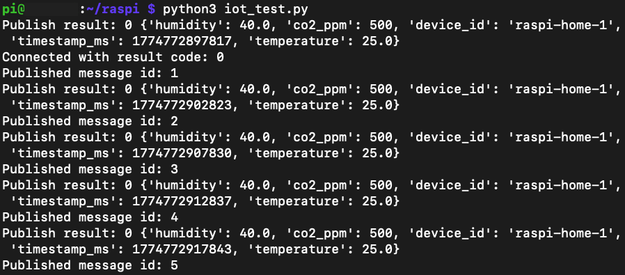

------------------------------------------------------------------------

# Step7. 結果確認
AWS 側で送信された payload を正しく受信・処理できているか確認する  
### ① CloudWatch Logs に Lambda ログが出ること
ラズパイ → IoT Core → Lambda トリガー → Lambda 内ロジック正常終了  
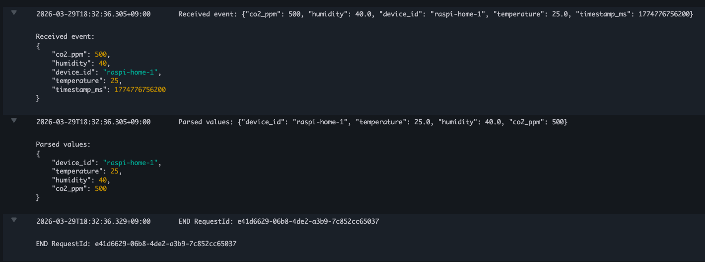
### ② DynamoDB にデータが保存されること
デバイスID、タイムスタンプ、CO2濃度、湿度、温度 が登録されている
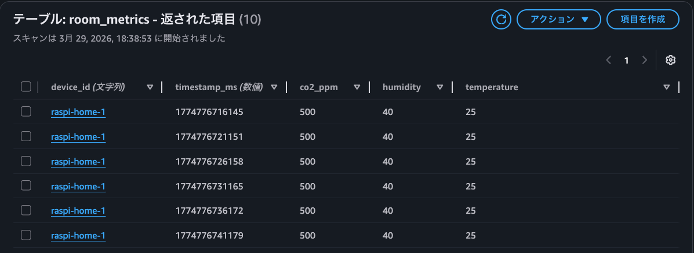

以上より、IoT Core と ラズパイの接続設定 & 動作確認を完了とする  
次はラズパイにセンサーを搭載し、実際にセンサーから取得したデータを payload として送信する

------------------------------------------------------------------------
