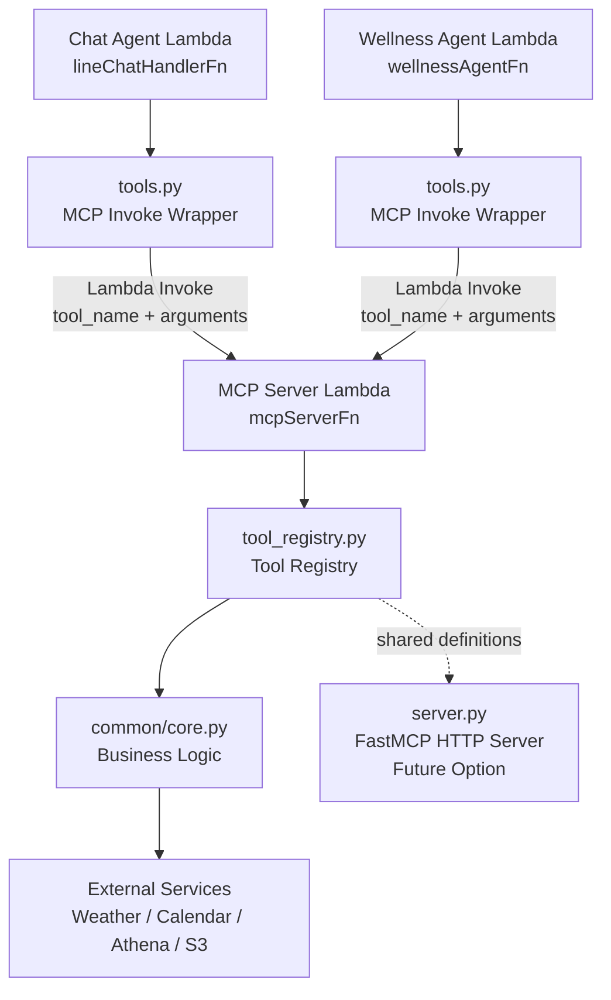

# ツール MCP化構想メモ

- [ツール MCP化構想メモ](#ツール-mcp化構想メモ)
- [MCP化の方針](#mcp化の方針)
- [MCP化のメリット](#mcp化のメリット)
- [アーキテクチャイメージ (chat\_agent)](#アーキテクチャイメージ-chat_agent)
- [システム構成](#システム構成)
- [ツール分類 (MCP化要否)](#ツール分類-mcp化要否)
- [MCP 通信方式](#mcp-通信方式)
- [エラーハンドリング方針](#エラーハンドリング方針)
- [作業ステップ](#作業ステップ)

---

# MCP化の方針
- ツール実装は core.py に集約し、MCP Server 側から呼び出す
- tools.py は Lambda invoke のラッパーとして残す
- Agent はツールの「説明」と「入出力」だけを認識する

→ MCP化により Agentを「意思決定」に専念させ、  
　ツールは「処理の実行」のみすることで、両者の責務分離を実現することができる  

※ 補足
- 本構成は MCP プロトコルの完全実装ではなく、  Lambda を用いた軽量な MCP 互換アーキテクチャとなる
- ツール定義（tool_registry）で MCP ツールを一元管理することで、Lambda実行・MCPサーバー（将来のHTTP化）双方に対応可能とする

---

# MCP化のメリット
- ツールによる重い処理を分離できる
  - 例: Athena集計 / matplotlib による画像生成
- スケール戦略を分けることができる
  - Agent は軽量環境で実行 (低メモリLambda)
  - ツールは高負荷に対応できる環境で実行 (高メモリLambda / コンテナ)
- 障害の影響範囲を分離できる
  - ツール失敗時も Agent はフォールバック可能
- ツールの再利用が可能 (管理負担軽減)
  - 今までは Chat Agent / Wellness Agent で別々の tools.py を実行していたが、MCP化後はツールが共通化される
- 開発・デプロイの独立性が高まる
  - ツール単体で改善・スケールが可能

---

# アーキテクチャイメージ (chat_agent)


---

# システム構成
## 現在の構成
今までの Strands Agent では、ツールを Lambda 内の tools.py から直接読み込んでいる

```python
from tools import get_weather_context_tool
```

フローは以下のイメージ (chat_agent)  
```
API Gateway  
  ↓  
Lambda (handler.py)  
  - Webhook受信  
  - Agent実行  
  ↓  
agent.py  
  - 推論・ツール選択  
  ↓  
tools.py（同一プロセス） 
  - ツール定義
  ↓  
core.py  
  - 実処理ロジック  
```

## MCP化後の構成
MCP化後は、tools は MCP Server (tools専用のAPIサーバー) から呼ばれる

```python
agent = Agent(
    tools=[...MCP tools...]
)
```

フローは以下のイメージ (chat_agent)  
```
API Gateway  
  ↓  
Lambda (handler.py)  
  - Webhook受信  
  - Agent実行  
  ↓  
agent.py  
  - 推論・ツール選択  
  ↓  
tools.py（MCP ラッパー）
  ↓ Lambda Invoke
MCP Server（Lambda）
  - ツール実行  
  ↓  
core.py  
  - 実処理ロジック  
```

## MCP Server の配置パターン
MCP Server は以下に配置することができる  
- ローカルプロセス
- Lambda
- コンテナ / ECS

👉 今回はサーバレス、運用負荷低減の観点から MCP Server も Lambda (高メモリ) で実装とする

---

# ツール分類 (MCP化要否)
全てのツールを MCP化すれば良いというわけではなく、処理内容から要否の判断をすることが重要  
今回は以下の基準で MCP化を判定する
- 軽い処理は Lambda (handler.py) で実行可能なため MCP化しない
- LINE 送信系はレイテンシ短縮のため MCP化しない

## MCP化するツール （高負荷 / 外部依存）
- generate_sensor_chart_report_tool（Athena + matplotlib）
- get_calendar_context_tool（外部API）
- get_weather_context_tool（外部API）

## MCP化しないツール（軽量 / LINE）
- get_environment_summary_tool
- format_line_message_tool
- reply_line_message_tool
- reply_line_text_and_image_message_tool

---

# MCP 通信方式
本実装では、MCP Server は HTTP ではなく Lambda Invoke により呼び出している
- Agent から MCP Server へは AWS Lambda Invoke (同期実行) を使用
- JSON 形式の payload を渡し、ツール実行結果を受け取る

※ 本来の MCP は HTTP / SSE ベースのプロトコルだが、  
　 本プロジェクトではサーバレス構成を優先し、Lambda RPC 形式で擬似的に実装している  

例: Lambda Invoke Payload

Request:  
```json
{
  "tool_name": "get_weather_context_tool",
  "arguments": {
    "target_datetime": "2026-04-27T08:00:00+09:00"
  }
}
```

Response (成功時):  
```json
{
  "ok": true,
  "result": {
    "weather": "晴れ",
    "temperature": 24
  }
}
```

---

# エラーハンドリング方針
- MCP Server 側で例外をキャッチし、構造化されたエラーを返す
  - 一時的な外部API エラーに対しては、MCP Server 側で数回程度リトライする
- Agent はツール失敗時にフォールバックする

Response (失敗時):  
```json
{
  "ok": false,
  "error": "Athena query failed"
}
```

## タイムアウト設計
- MCP Server 側は長時間処理に対応できるタイムアウト設定とする（90秒）
- Agent 側ではツール呼び出しのタイムアウトを考慮し、失敗時のフォールバックを実装する

## ツール失敗時の Agent 挙動
ツール失敗時は最低限の情報で回答をするような仕組みとする  
- グラフ生成失敗 → テキストのみで回答
- カレンダー取得失敗 → 天気のみで回答

---

# 作業ステップ
MCP化による不具合発生と混乱を避けるため、以下のステップで進めていく

## 1. MCP Server 作成
- Lambda handler でツール実行エンドポイントを作成
- tools.py のロジックを移植

## 2. 低負荷ツールで接続確認
- get_weather_context_tool を MCP化
- Agentから呼べることを確認

## 3. 高負荷ツールで接続確認
- generate_sensor_chart_report_tool を MCP化
- Agentから呼べることを確認

## 4. Agent 側の tools 差し替え
- tools.py → MCP 呼び出しへ変更

## 5. 不要コード整理
- tools.py を MCP 呼び出しラッパーとして整理

---
