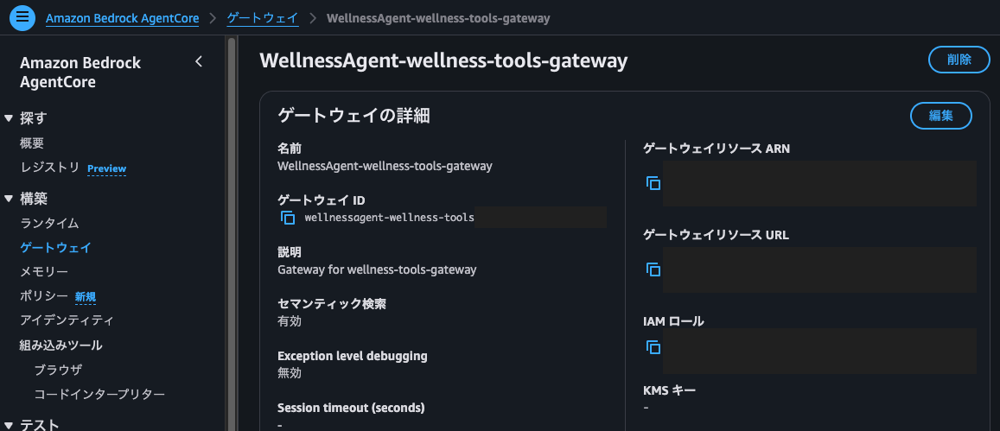

# AgentCore化 構想メモ

- [AgentCore化 構想メモ](#agentcore化-構想メモ)
- [AgentCore化 の目的](#agentcore化-の目的)
- [AgentCore化 のゴール](#agentcore化-のゴール)
- [AgentCore Gateway化 によるメリット](#agentcore-gateway化-によるメリット)
- [今回の AgentCore化 対象](#今回の-agentcore化-対象)
- [移行方針](#移行方針)
- [ツールの AgentCore Gateway化 手順](#ツールの-agentcore-gateway化-手順)

---

# AgentCore化 の目的
- Agent 実行基盤をマネージド化する
- ツール連携を標準化する
- 将来的な Memory / Identity / Observability 拡張に備える

---

# AgentCore化 のゴール
本プロジェクトでは、以下の段階的移行を目指す  
**※ 現行のシステムでも安定稼働できているため、今回は Step1 の Gateway のみを対象とする**  

## Step 1: ツール実行基盤を AgentCore Gateway に移行 (今回の目標)
現在 mcpServerFn で Lambda Invoke により実行しているツール群を、  
AgentCore Gateway のツールとして登録し、Agent から直接呼び出せる構成に移行する  

👉 ツール呼び出しの標準化・管理・セキュリティを AgentCore のマネージド機能へ寄せる  

## Step 2: Agent 実行を Runtime へ移行 (オプション)
chat_agent Lambda / wellness_agent Lambda を AgentCore Runtime に移行する  
```
【現在】

Lambda 上で Strands Agent を実行
  ↓
Bedrock Claude を呼ぶ
```
```
【AgentCore Runtime化】

AgentCore Runtime 上で Agent アプリを実行し、
ツール実行・Observability・Identity などを AgentCore ネイティブ構成へ統合
  ↓
Bedrock Claude などのモデルを呼ぶ
```

## Step 3: Memory / Observability を追加検討 (オプション)
Agentシステムの **監視 / メトリクス可視化 / デバッグ** 機能を強化する  

👉 AgentCore Observability は CloudWatch ベースのダッシュボードやテレメトリで、  
　 セッション数、レイテンシ、実行時間、トークン使用量、エラー率などを見るための機能

AWS 公式ドキュメント:  
[Observe your agent applications on Amazon Bedrock AgentCore Observability](https://docs.aws.amazon.com/bedrock-agentcore/latest/devguide/observability.html)

---

# AgentCore Gateway化 によるメリット
- Agent は Gateway から tool schema を取得するため、
  Agent 側でツール定義を実装する必要がなくなる
- 新規ツール追加時も、
  Gateway target と schema.json を追加するだけで利用可能
- Lambda / ECS / 外部API など、
  ツール実行環境を統一的に扱える
- Agent 側から実行環境の違いを意識する必要がない

---

# 今回の AgentCore化 対象
上記を踏まえて、このフェーズで実装する内容は以下となる  

実装対象:  
- **AgentCore Gateway**: mcpServerFn のツール群を管理・公開する方法を検証・実装する

実装対象外:  
- **AgentCore Runtime**: Agent 実行基盤の移行は将来検討する
- **AgentCore Observability**: 監視強化は将来検討する
- **AgentCore Memory / Identity**: 必要になった段階で検討する

---

# 移行方針
- 現行構成を残す
- AgentCore Gateway から既存 mcpServerFn を Gateway Target として呼び出す
- Agent とツール間の通信は MCP protocol に統一する  
  （Agent は MCP 経由でツール一覧・引数定義・実行API を取得する）
- ツール単位で段階的に Gateway へ切り替える
- 動作確認後、Runtime移行を検討

---

# ツールの AgentCore Gateway化 手順

## 対象ツール
今回は以下のツールを AgentCore Gateway に登録し、Agent は Gateway 経由でツールを実行できるようにする  
- get_weather_context_tool
- get_calendar_context_tool
- generate_sensor_chart_report_tool

## AgentCore Gateway 作成手順
### ① AgentCore インストール  
```bash
npm install -g @aws/agentcore
agentcore --help
```

### ② プロジェクト作成
```bash
agentcore create
```
コマンド実行時に入力を求められる場合は、以下を設定する  
- Project name: WellnessAgent
- Agent name: WellnessAgent
- Select agent type: Bring my own code
- 以降はデフォルトのまま (Enter連打) で進めて OK 

### ③ Gateway 追加  
```bash
cd WellnessAgent
brew install uv

agentcore add gateway \
  --name wellness-tools-gateway \
  --authorizer-type NONE

agentcore deploy
```

`agentcore deploy` がうまくいかない場合は、  
作成した Agent のフォルダにダミーの最小構成 `pyproject.toml` を配置する  
また、権限エラーの場合は local-user に `AdministratorAccess` を一時付与する  
```bash
cat > app/WellnessAgent/pyproject.toml <<'EOF'
[project]
name = "wellness-agent"
version = "0.1.0"
requires-python = ">=3.12"
dependencies = [
  "opentelemetry-instrumentation",
  "opentelemetry-distro"
]
EOF

cat > app/WellnessAgent/main.py <<'EOF'
def handler(event, context=None):
    return {"ok": True, "message": "placeholder agent"}
EOF

# 再度 deploy
agentcore deploy
```

### ④ Gateway target 追加
Agent がツール一覧として参照する `schema.json` を作成し、ツールを target として登録する  
```bash
mkdir -p schemas
cat > schemas/wellness_tools_schema.json <<'EOF'
[
  {
    "name": "get_weather_context_tool",
    "description": "指定日時の天気情報、外気温、湿度、最高・最低気温、季節に応じた健康アラートを取得する。朝・昼・夕方・夜、明日など特定時間帯の天気確認や、傘・服装・換気・体調管理の判断に使用する。",
    "inputSchema": {
      "type": "object",
      "properties": {
        "target_datetime": {
          "type": "string",
          "description": "確認したい日時。ISO 8601形式で指定する。例: 2026-05-05T18:00:00+09:00"
        }
      },
      "required": ["target_datetime"]
    }
  },
  {
    "name": "get_calendar_context_tool",
    "description": "Google Calendarから今後の予定を取得する。会議、外出、休憩タイミング、作業計画など、スケジュールを踏まえた回答や提案を行う場合に使用する。",
    "inputSchema": {
      "type": "object",
      "properties": {},
      "required": []
    }
  },
  {
    "name": "generate_sensor_chart_report_tool",
    "description": "指定期間の室内環境データから、CO2・温度・湿度の推移グラフ画像と要約統計を生成する。ユーザが室内環境の推移、グラフ、レポート、1時間/1日/1週間の状況確認を求めた場合に使用する。",
    "inputSchema": {
      "type": "object",
      "properties": {
        "period": {
          "type": "string",
          "description": "取得期間。1時間なら '1h'、1日/今日なら '1d'、1週間なら '7d' を指定する。",
          "enum": ["1h", "1d", "7d"]
        }
      },
      "required": ["period"]
    }
  }
]
EOF
```

```bash
agentcore add gateway-target \
  --gateway wellness-tools-gateway \
  --name wellness-tools-target \
  --type lambda-function-arn \
  --lambda-arn <mcpServerFnのARN> \
  --tool-schema-file schemas/wellness_tools_schema.json
```

### ⑤ 最終デプロイと Gateway の確認
```bash
agentcore deploy
```
デプロイが成功したらコンソールから Gateway を確認する  
**Amazon Bedrock AgentCore > ゲートウェイ > WellnessAgent-wellness-tools-gateway**  


**ゲートウェイリソース URL** を Agent Lambda `wellnessAgentFn`、`lineChatHandlerFn` に登録すれば完了  

登録した URL は、各 Agent の `agent.py` から参照され、Agent は MCPClient 経由で Gateway に接続し、  
Gateway が公開する tool schema を取得してツールを認識・使用することができる  
```python
agentcore_gateway_client = MCPClient(
    lambda: streamablehttp_client(os.environ["AGENTCORE_GATEWAY_URL"]),
)

agent = Agent(
    model=model,
    tools=[
        agentcore_gateway_client,
    ],
    system_prompt=SYSTEM_PROMPT,
)
```


以上が AgentCore Gateway にツールを登録する手順となる  

### 【補足】 Gateway URL の管理
Gateway URL はハードコードせずに、ローカル設定ファイル `config/local.json` で管理する

例:
```json
{
  "agentcoreGatewayUrl": "https://xxxxx.gateway.bedrock-agentcore.ap-northeast-1.amazonaws.com/mcp"
}
```

### 【補足】 今回 CLI ベースで構築した理由
今回は AgentCore Gateway のみを導入するため、既存 CDK に統合せずに、
AgentCore CLI を使用して Gateway を作成した  

これにより、最小の変更で以下の検証と構築を進めることができた  
- Gateway 単体の動作確認
- MCP protocol によるツール連携
- 既存 Agent との疎結合化
- Lambda Invoke ベース構成から AgentCore への移行

将来的には `@aws/agentcore-cdk` を利用した既存 CDK への統合も検討する  

---
