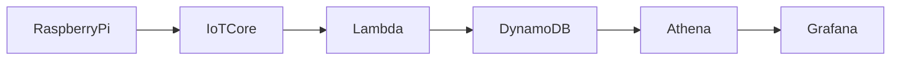

# Grafana データ可視化手順書

## 目的
SCD40 と接続したラズパイから送信 → DynamoDB に登録されたセンサーデータを  
Amazon Managed Grafana を使用してグラフに表示する

------------------------------------------------------------------------

## 構成概要

※ Raspberry Pi 3 Model B V1.2 使用

------------------------------------------------------------------------

## 前提
Athena 実行結果格納用 S3 バケットを作成していること  
※ 後の設定で必要なため、空の prefix を作成しておく  


------------------------------------------------------------------------

## ステップ
1. Athena DynamoDB コネクタ作成
2. Athena 動作確認
3. Grafana Workspace 作成
4. Grafanaログイン
5. Athena データソース追加
6. ダッシュボード作成

------------------------------------------------------------------------

## Step1. Athena DynamoDB コネクタ作成

左のメニューから **データソースとカタログ** を選択し、
**データソースの作成** をクリックする  


**Amazon DynamoDB** を選択し、**次へ** をクリックする  


**データソース名**、**Amazon S3 内の流出場所** を入力し、**次へ** をクリックする  
※ S3 は prefix まで指定が必要  


データソースが正常に作成されることを確認する


------------------------------------------------------------------------

## Step2. Athena 動作確認

以下のクエリを実行し、DynamoDBのデータを取得できれば成功  
```sql
SELECT *
FROM "dynamodb_datasource"."room_metrics"
LIMIT 10;
```

