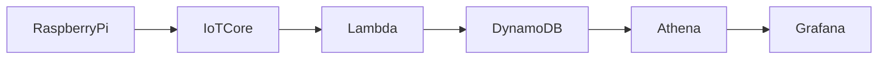
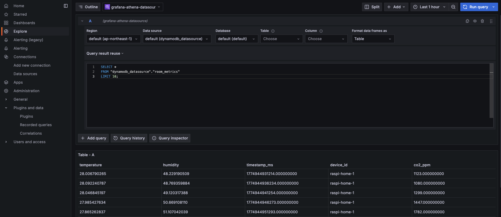
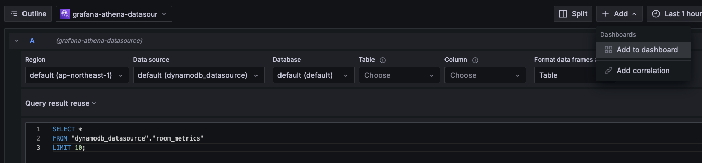
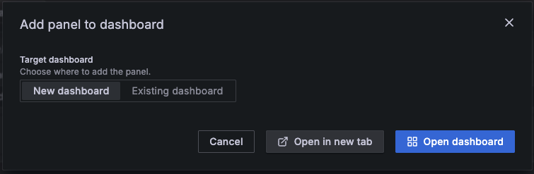
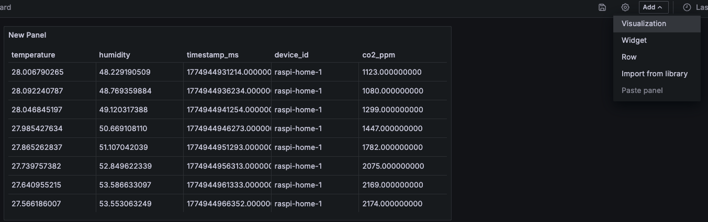
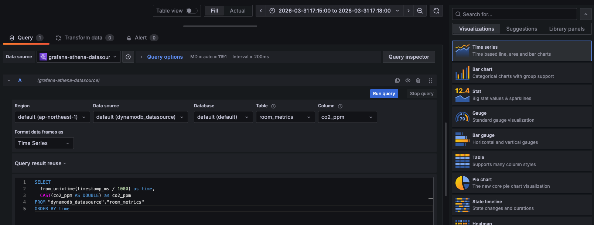
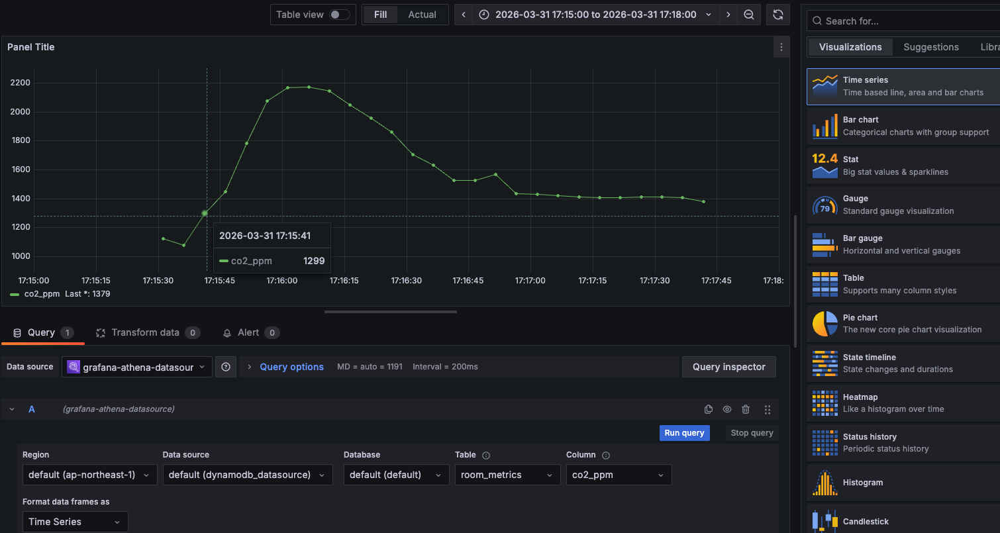
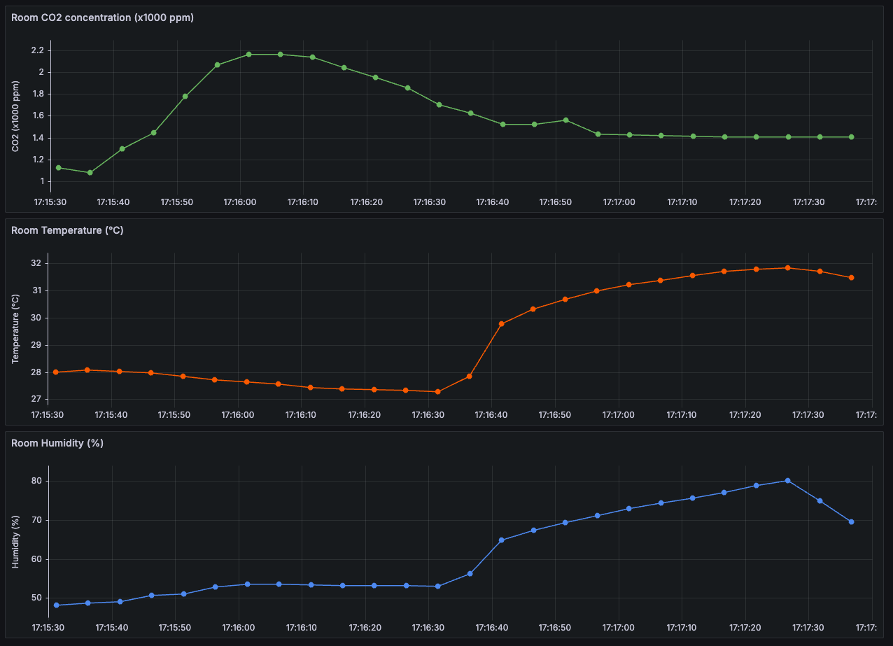
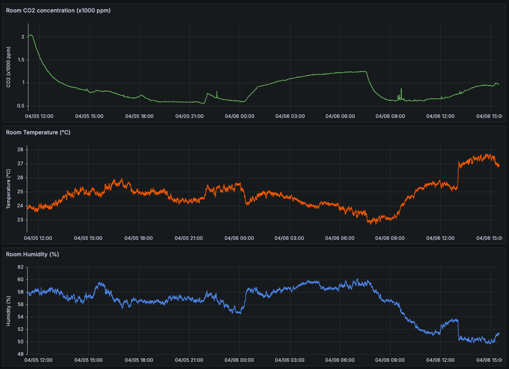

# Grafana データ可視化手順書

## 目的
SCD40 と接続したラズパイから送信 → DynamoDB に登録されたセンサーデータを  
Amazon Managed Grafana を使用してグラフに表示する  

[測定データのグラフはこんな感じ](#おまけ)

------------------------------------------------------------------------

## 構成概要

※ Raspberry Pi 3 Model B V1.2 使用

------------------------------------------------------------------------

## 前提
Athena 実行結果格納用 S3 バケットを作成していること  
※ 後の設定で必要なため、空の prefix を作成しておく  


------------------------------------------------------------------------

## 注意事項
- Amazon Managed Grafana は無料期間終了後は課金されるため、不要な場合は削除すること

------------------------------------------------------------------------

## ステップ
1. Athena DynamoDB コネクタ作成
2. Athena 動作確認
3. Grafana Workspace 作成
4. Grafanaログイン
5. Athena データソース追加
6. ダッシュボード作成

------------------------------------------------------------------------

## Step1. Athena DynamoDB コネクタ作成
左のメニューから **データソースとカタログ** を選択し、
**データソースの作成** をクリックする  


**Amazon DynamoDB** を選択し、**次へ** をクリックする  


**データソース名**、**クエリ結果の出力先（S3）** を入力し、**次へ** をクリックする  
※ S3 は prefix まで指定が必要  


データソースが正常に作成されることを確認する  


------------------------------------------------------------------------

## Step2. Athena 動作確認
以下のクエリを実行し、DynamoDBのデータを取得できれば成功  
```sql
SELECT *
FROM "dynamodb_datasource"."room_metrics"
LIMIT 10;
```


------------------------------------------------------------------------

## Step3. Grafana Workspace 作成
トップページから **ワークスペースを作成** をクリックする  


**ワークスペース名** を入力して **次へ** をクリックする  


**認証アクセス** では **AWS IAM ID センター** を選択する  


Grafana にログインするためのユーザを作成する  


他の項目はデフォルトのまま進み、**ワークスペースを作成** をクリックする  


ワークスペースの作成が完了する  
```log
Your account is not a member of an organization.
```
というエラーが出る場合は、後続のログインユーザとパスワードの設定を行う  


### ユーザ認証基盤の設定
#### ① IAM Identity Center ユーザ登録
AWS から IAM Identity Center の招待メールが来ている場合は  
**Accept invitation** をクリックしてユーザ登録を行う  


パスワードを作成し、サインインに成功すれば完了  
※ これにより、IAM Identity Center にログインするための認証情報が作成される


#### ② Grafana ユーザ割り当て
ワークスペース上で以下のメッセージが表示される場合は、  
```log
IAM ID センターユーザーまたはユーザーグループが割り当てられていません。
```
**新しいユーザーまたはグループの割り当て** をクリックする  


ワークグループ作成時に作成したユーザを選択し、**ユーザーとグループを割り当て** をクリックする    


ユーザが登録されていれば完了  


------------------------------------------------------------------------

## Step4. Grafanaログイン
ワークスペースに表示されている **Grafana ワークスペース URL** にアクセスし、  
**Sign in with AWS IAM Identity Center** をクリックし、Grafana にサインインする  


IAM Identity Center の認証情報を入力し、**サインイン** をクリックする  


Grafana のトップページにアクセスできれば、サインイン成功となる


------------------------------------------------------------------------

## Step5. Athena データソース追加
Grafana のデータソースに Athena を追加し、ダッシュボードにデータを描画する　　

### 前提
Grafana のユーザのユーザタイプが **管理者** であること  
ユーザを選択して **アクション** から **管理者を作成する** を選択すると管理者に変更できる  


ワークスペースの **データソース** タブから **Amazon Athena** がアタッチされていない場合は、  
選択後に **アクション** からアタッチを有効化する  


**ワークスペース設定オプション** から **プラグイン管理** の **編集** に進み、  

**プラグイン管理をオンにする** にチェックを入れて **変更の保存** をクリックする  


---

### Data sources 設定
左側のメニューの **Connections** から **Add new connection** を選択し、  
**Amazon Athena** をクリックする  


右上の **Install** ボタンをクリックし、Athena をインストールする  
※ ここで以下のメッセージが表示される場合は、**前提** に記載した設定を確認すること  
```log
You do not have permission to install this plugin.
```


インストールが完了したら **Add new data source** ボタンをクリックする  


以下の項目を設定し、**Save & test** が成功すれば完了  
- Name：データソース名（**default** は有効化）
- Authentication Provider：**Workspace IAM Role** のままで OK
- Default Region：ap-northeast-1
- Data source：作成した Athena のデータソース名
- Database：default
- Workgroup：primary
- Output Location：Athena のクエリの結果格納先 S3 prefix


---

#### エラー対策
**Save & test** で失敗する場合、原因の多くが Grafana 用 IAM ロールの権限不足のため、以下を確認する
- **Output Location** の S3 バケットに対して `GetBucketLocation` 権限があるか
- Athena の DynamoDB コネクタの Lambda に対して`lambda:InvokeFunction` 権限があるか
------------------------------------------------------------------------

## Step6. ダッシュボード作成
左のメニューから **Explore** を選択し、以下のクエリを入力して **Run query** をクリックする  
→ DynamoDB のセンサデータが取得できることを確認  
```sql
SELECT *
FROM "dynamodb_datasource"."room_metrics"
LIMIT 10;
```


**+Add** ボタンから **Add to dashboard** を選択し、  


**New dashboard** から **Open in new tab** をクリックする  


ダッシュボード画面に移動する  
時系列グラフをダッシュボードに追加するため、**Add** から **Visualization** を選択する


右側のグラフタイプから、**Time series** を選択し、  
CO2濃度を取得するクエリを入力して **Run query** をクリックする  
※ Athenaでは数値が文字列として扱われる場合があるため、CASTで数値型に変換する  
```sql
SELECT
  from_unixtime(timestamp_ms / 1000) as time,
  CAST(co2_ppm AS DOUBLE) as co2_ppm
FROM "dynamodb_datasource"."room_metrics"
ORDER BY time
```


時系列グラフが作成される  


以上で、**DynamoDB に登録した SCD40 のデータを Grafana で可視化**することができた  

------------------------------------------------------------------------

## おまけ
最終的なダッシュボードは以下となる  
→ 実際の環境変化（呼気・体温）がセンサーデータとして可視化されていることが確認できる
- CO2：息を吹きかけ急上昇 → 徐々に低下
- 温度：呼気の後に手で握ったため、遅れて上昇
- 湿度：温度に追従するように上昇



### 一日分のデータ集計結果
Agent の判定基準の参考として、一日の室内データを集計した  

#### 測定条件
- 夜間は窓を閉め切る（換気なし）
- 起床後、以下のタイミングで換気を行った
  - 4/5 11:30
  - 4/6 7:30
- 日中は PC を付けて作業を行う
#### グラフから読み取れること
- 夜間に換気を止めることで CO2 が上昇（〜2000ppm）  
- 起床後に換気することで CO2 が一気に低下（〜600ppm）  
  👉 換気の効果の大きさを可視化できている  
- 夜間は温度が安定（24〜25℃）、朝は少し低下、昼は上昇（PC作業＋日中）  
  👉 生活によるデータのトレンドが読み取れる  
- 湿度も温度や CO2 に追従した変化が確認できる
#### システムに反映すべきポイント
- CO2は「瞬間値」だけじゃダメ  
  👉 今だけ高いのか？ / 長時間高いのか？ を考慮すべき  
- Agent に見せるべき情報は以下
  - ① 最新値（今の状態）
  - ② 1時間の平均値（普段の状態）
  - ③ 最大値（ピーク）
  - ④ トレンド（上昇傾向 / 下降傾向）

### 各グラフのクエリ
#### CO2
```sql
SELECT
  from_unixtime(timestamp_ms / 1000) as time,
  CAST(co2_ppm AS DOUBLE) / 1000 as co2_ppm
FROM "dynamodb_datasource"."room_metrics"
WHERE
  device_id = 'raspi-home-1'
  AND timestamp_ms BETWEEN $__from AND $__to
ORDER BY time
```
#### Temperature
```sql
SELECT
  from_unixtime(timestamp_ms / 1000) as time,
  CAST(temperature AS DOUBLE) as temperature
FROM "dynamodb_datasource"."room_metrics"
WHERE
  device_id = 'raspi-home-1'
  AND timestamp_ms BETWEEN $__from AND $__to
ORDER BY time
```
#### Humidity
```sql
SELECT
  from_unixtime(timestamp_ms / 1000) as time,
  CAST(humidity AS DOUBLE) as humidity
FROM "dynamodb_datasource"."room_metrics"
WHERE
  device_id = 'raspi-home-1'
  AND timestamp_ms BETWEEN $__from AND $__to
ORDER BY time
```

------------------------------------------------------------------------
