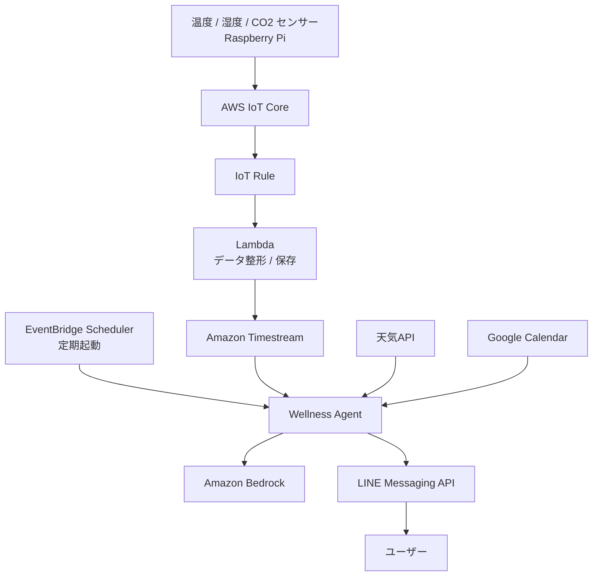

# 在宅ワーク健康支援AIエージェント（ai-home-work-wellness-agent）

## 欲望
- AI Agent システムを作りつつ学びたい
- Strands SDK / AgentCore を使って開発したい
- IoT Core 使いたい
- 電子工作したい
- Timestream 使いたい（Grafanaで可視化したい）
- LINE と連携させたい
- いい感じのアーキ図描きたい
- どうせ作るなら役に立つものを実用レベルまで仕上げる

---

## コンセプト
- AI エージェント + IoT センサー + 生活の役に立つ何か  
**👉 在宅ワーク健康支援AIエージェント**

--- 

## MVP 機能

### MVP
- センサーデータを IoT Core 経由でAWSへ送る
- Timestream に保存
- 定期的に Agent が状況判定
- LINE に提案通知

### 提案内容
- 換気
- 水分補給
- 短いストレッチ
- 散歩提案（天気と予定が合えば）
    - 天気情報取得API、Googleカレンダー連携

--- 

## MVP 構成

---

## ハード
IoT Core で扱いやすいハードが望ましい

### ⭕️ Raspberry Pi + センサー
- Python との相性が良い
- AWS IoT Core に繋ぎやすい
- 拡張しやすい（カメラやマイク・スピーカーなど）
- Agent 側のローカル前処理がやりやすい

### 🔺 Arduino系 + センサー
- マイコン側の実装あり
- 開発・デバッグの難易度が上がる
- AWS接続も工夫が必要になる

### ❌ 既製品の Wi-Fi 温湿度計
- データ連携のしやすさは機種によりけり
- AWS IoT Core と直接つなぎにくい
- 「自分で作った感」が減る🥺

--- 

## センサー

### CO2 センサー
- CO2 高い → 換気 の提案
- SCD40 / SCD41 / MH-Z19C
    - https://akizukidenshi.com/catalog/g/g117851/
    - ⬆️ なら CO2 に加えて、温度、湿度も測定できる
    - 高精度（±50ppm + 5%）、ラズパイと接続可

### 温湿度センサー
- 温度高い → 室温調整 / 水分補給 の提案
- 湿度低い → 乾燥対策 の提案
- BME280 / SHT31
    - https://akizukidenshi.com/catalog/g/g109421/

---

## IoT Core 採用理由
センサー値を API Gateway に POST する構成にすることも可能だが、
以下の点で IoT Core を採用する
- IoT 向けの接続方式が最初から揃っている（実装が楽）
    - デバイス認証
	- MQTT 通信
	- topic ベース配信
	- ルールエンジン

- デバイス証明書ベースで安全
    - デバイスごとに証明書を持たせて接続できる

- MQTT が使用できる
    - 軽量で小さいデータを送りやすい
    - 常時接続がしやすい
    - pub/sub と相性が良い

- pub/sub が使える
    - 双方向性や拡張性が高い
    - デバイス: publish
    - 接続先: subscribe

- IoT Rule が便利
    - メッセージをどこに流すかルール定義が可能
        - Timestream に保存
	    - Lambda を起動
	    - DynamoDB に保存
        - etc...

---

## LINE連携

Slack 通知は散々やってるので LINE を使いたい  
モバイル連携向けな点も👌

### Push通知（イメージ）
「CO2 が高めです。次の会議まで15分あるので、今のうちに5分だけ換気しませんか？」

### 質問応答
ユーザー:  
「今の部屋の状態どう？」  
  
Agent:  
「現在 CO2 は 1380ppm で高めです。室温は 28.1℃ です。  
今日は 90分以上座りっぱなしなので、短い休憩と換気をおすすめします。」  

---
