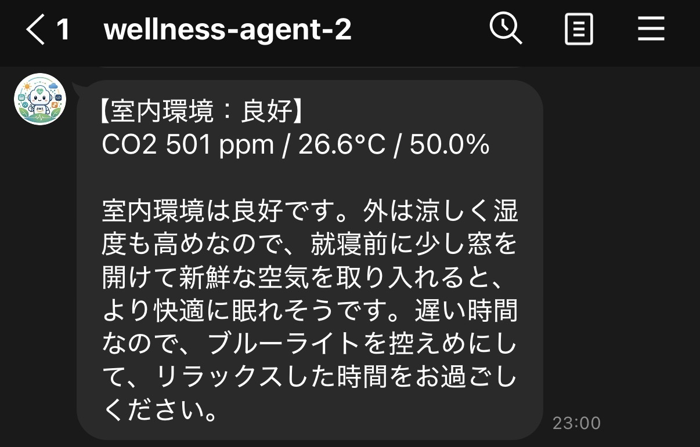
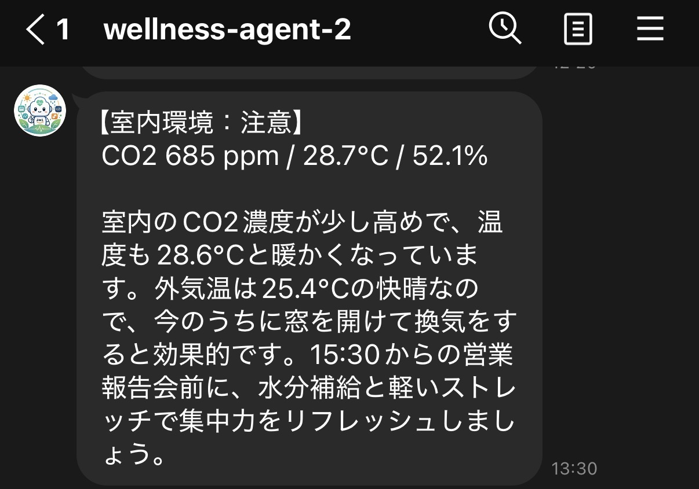
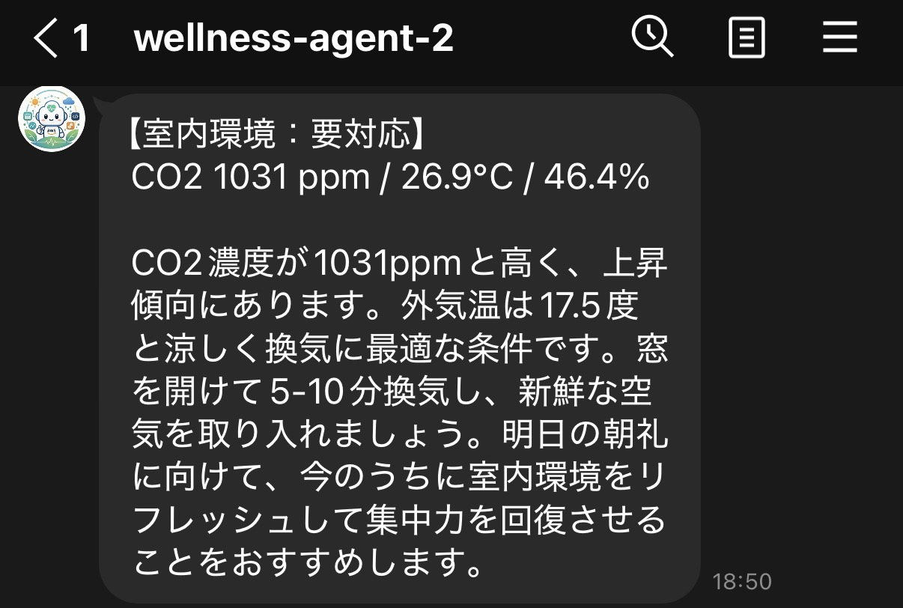
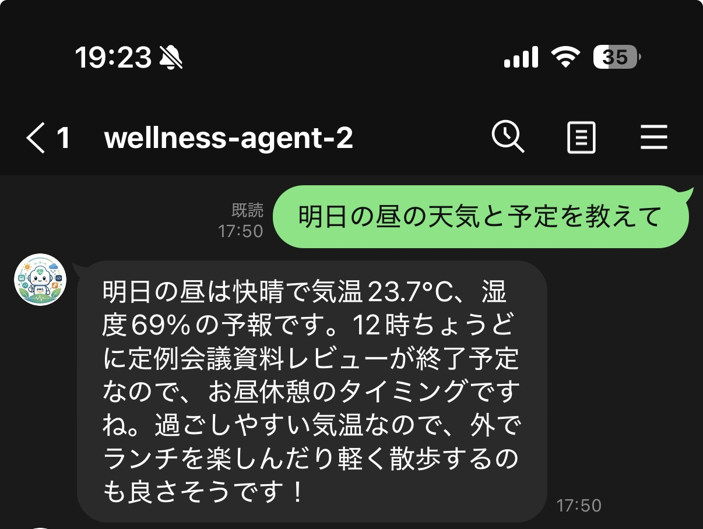
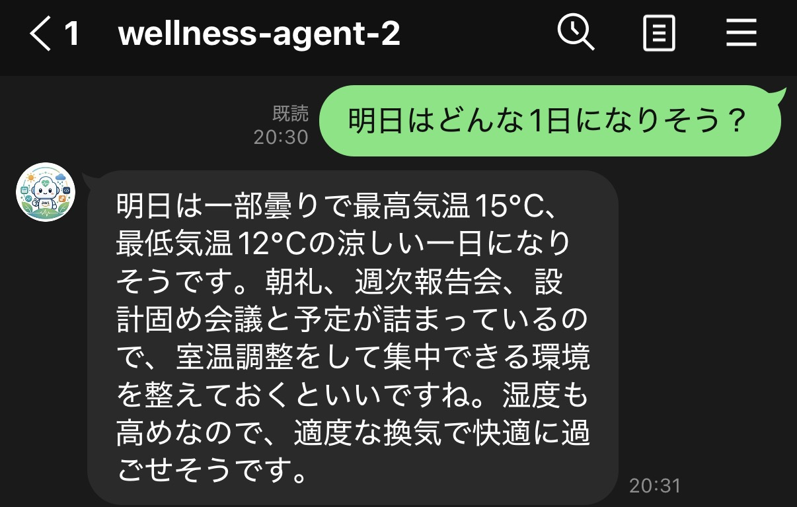
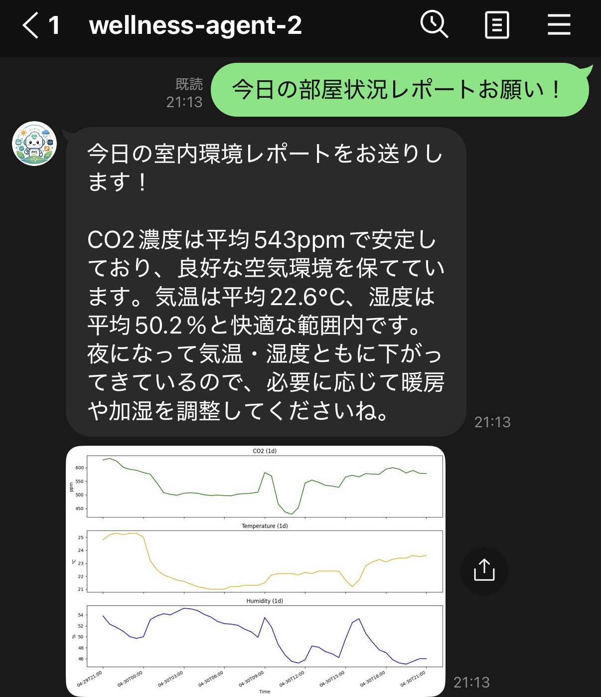
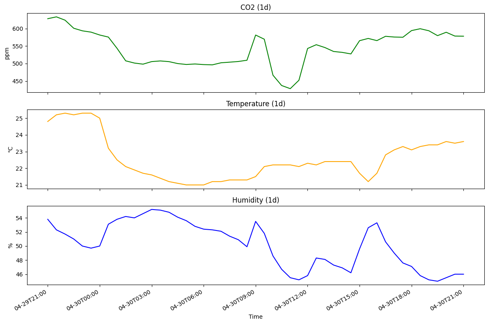
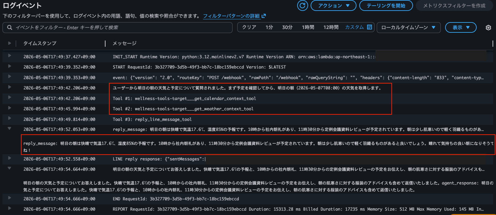
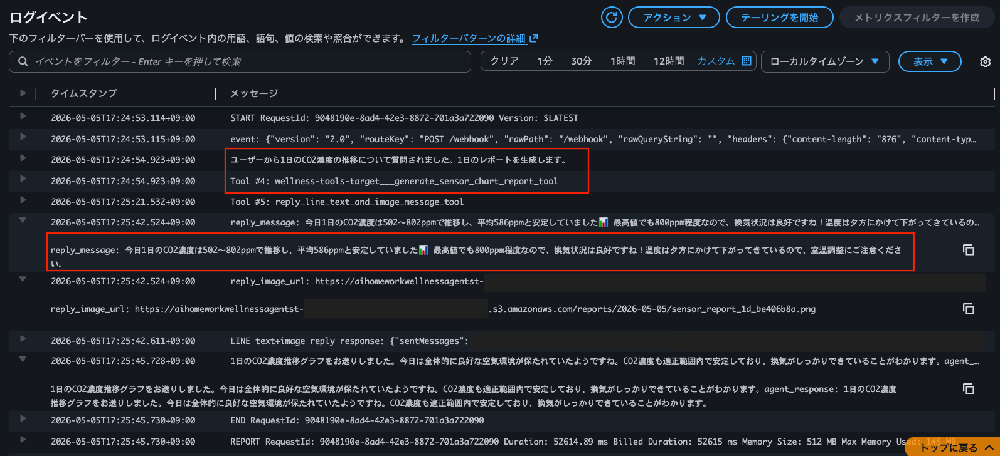
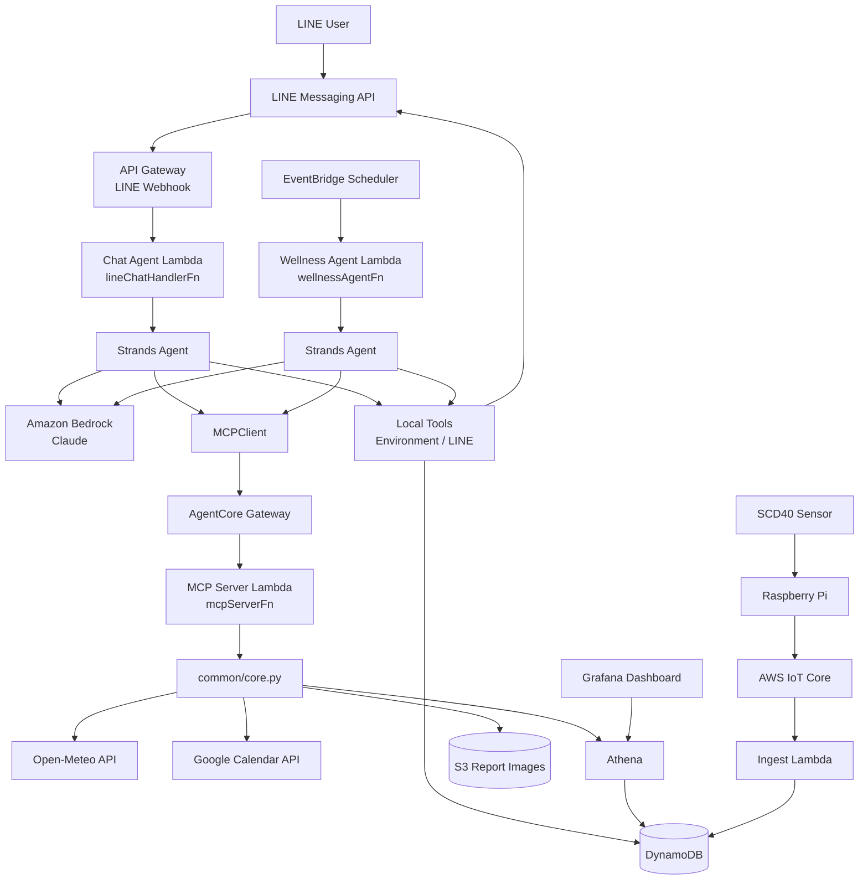

# AI Home Work Wellness Agent

室内環境・天気・予定を統合的に判断し、  
LINE 上で健康アドバイスを行う AI Wellness Agent

---

- [AI Home Work Wellness Agent](#ai-home-work-wellness-agent)
- [デモンストレーション](#デモンストレーション)
- [システム概要](#システム概要)
- [主な機能](#主な機能)
- [システムアーキテクチャ](#システムアーキテクチャ)
- [AI Agent アーキテクチャ](#ai-agent-アーキテクチャ)
- [技術的な工夫ポイント](#技術的な工夫ポイント)
- [使用技術](#使用技術)
- [セットアップ手順](#セットアップ手順)
- [今後の改善](#今後の改善)
- [License](#license)

---

# デモンストレーション

## 健康アドバイス定期通知機能

室内の **CO2濃度、温度、湿度** に応じて、室内環境を評価し、  
天気やスケジュールに基づいた健康アドバイスを定期通知してくれる機能  

**室内環境： 良好** なときの通知例:  

**室内環境： 注意** なときの通知例:  

**室内環境： 要対応** なときの通知例:  

- 定期実行（良好 / 注意 / 用対応）

---

## LINE での対話型 AI アシスタント機能

室内環境や天気、スケジュールに関する質問を LINE 上でやりとりできる機能  

**「明日の昼の天気と予定を教えて」** に対する回答例:  

**「明日はどんな1日になりそう？」** に対する回答例:  

---

## 室内環境レポート生成機能

指定した期間の室内環境のレポートを作成・報告してくれる機能  

**1日の室内環境レポート** の例:  

グラフは以下のように画像形式で作成される  

---

### Agent の推論ログ

本システムでは、AI Agent が状況に応じて必要なツールを動的に選択し、最終的な回答を生成する  
Agent が使用可能なツールは以下となる  

| No. | ツール名 | 用途 |
|---|---|---|
| #1 | get_calendar_context_tool | Google Calendar からスケジュールを取得 |
| #2 | get_weather_context_tool | Open Meteo から 天気情報を取得 |
| #3 | generate_sensor_chart_report_tool | 室内データのグラフ画像と要約を取得 |

CloudWatch Logs のログから、Agent が推論時にツールを選択していることが確認できる  

ユーザに **明日の朝の天気と予定** を質問されたことに対して、  
Agent が `get_calendar_context_tool` と `get_weather_context_tool` の使用を判断し、  
ツールの実行結果を基に最終的な回答を生成していることがわかる  

ユーザに **1日のCO2濃度の推移** を質問されたことに対して、  
Agent が `generate_sensor_chart_report_tool` の使用を判断し、  
ツールの実行結果を基に室内環境レポートを生成していることがわかる  

---

# システム概要

在宅ワークで仕事に集中していると、以下の要素に気づきにくい  
これらが原因で、作業効率の低下や体調不良を引き起こす可能性がある  

- 換気不足（CO2濃度上昇）
- 温度 / 湿度の変化
- 過密スケジュール
- 天候の変化

本システムでは、このような情報を基に AI Agent が健康アドバイスを生成し、  
ユーザに LINE 通知することで、作業効率の向上や適切な体調管理を促すことを目的としている  

---

# 主な機能

本システムに搭載されている機能は以下となる  

### 1. 健康アドバイス生成
Agent が以下の情報を取得・統合的に判断し、ユーザに適切な行動提案を LINE 上で通知する  

- センサから得られた室内データ（CO2 / 温度 / 湿度）
- 天気情報（天気 / 最低・最高気温 / 湿度 / 気候アラート）
- Google Calendar スケジュール（一時間以内の予定有無 / 直近の予定3件）

また、Agent は **一定期間ごとの通知** と、**チャット応答** の異なる起動方法に対応している  

### 2. 室内環境レポート生成
Agent が指定期間における室内環境のレポートを作成し、LINE 上で報告する  
レポートは以下の要素で構成される  

- 室内データのグラフ画像（CO2 / 温度 / 湿度）
- 室内データの傾向に基づいた Agent の分析コメント

### 3. AgentCore Gateway による MCP Tool 管理
Agent が Gateway 経由でツールを実行する仕組みにすることで、  
実行環境の分離や運用コスト低減を実現している  

---

# システムアーキテクチャ

---

# AI Agent アーキテクチャ

本システムでは、Strands Agents を利用して  
複数ツールを推論ベースで動的選択する AI Agent を構築している  

前述の通り、Agent は以下の情報を統合して判断する  
- 室内環境
- 天気
- スケジュール
- 時間帯
- センサデータ推移

---

## MCP / AgentCore Gateway によるツール管理

ツール実行は AgentCore Gateway + MCP protocol に統一している

これにより、以下を実現した構成としている
- Agent 側からツール実装を疎結合化
- Lambda / ECS / 外部 API を統一的に扱う
- schema ベースでツールを動的認識
- ツール追加時の Agent 修正を最小化

📝TODO:
- MCP / AgentCore Gateway の構成図を貼る
- 「Agent ⇔ Gateway ⇔ Lambda Tool」の流れを図示

---

# 技術的な工夫ポイント

## 1. 推論ベースの Tool Selection

単純な Function Calling ではなく、  
AI Agent が状況に応じて必要なツールを判断している  

例:  

- 「明日の朝の天気と予定を教えて」
  - Calendar Tool
  - Weather Tool

- 「1日の CO2 推移を見せて」
  - Report Generation Tool

---

## 2. MCP ベースの疎結合アーキテクチャ

ツール実行を MCP protocol に統一し、  
AgentCore Gateway から tool schema を取得する構成としている  

これにより、以下を実現している　　
- ツール実装の分離
- 実行環境の抽象化
- 将来的な Runtime 移行
- サーバレス MCP 構成

---

## 3. サーバレス構成

本システムは Lambda + AgentCore Gateway により、  
MCP ベースのツールアーキテクチャをサーバレスで実現している　　

従来の MCP Server のように ECS などの常駐サーバを必要とせず、  
AWS マネージドな構成で動作する  

---

## 4. コンテキスト統合理解

単なるセンサ監視ではなく、以下の情報を横断的に判断し、  
ユーザー行動に合わせた自然なアドバイスを生成する  
- 室内環境
- 天気
- スケジュール
- 時間帯

---

# 使用技術

| 技術 | 用途 |
|---|---|
| AWS Lambda | Agent / Tool 実行 |
| Amazon Bedrock | LLM 基盤 |
| Strands Agents | AI Agent Framework |
| AgentCore Gateway | MCP Tool 管理 |
| MCP protocol | Tool 標準化 |
| AWS IoT Core | MQTT ingestion |
| DynamoDB | センサーデータ保存 |
| Athena | データ分析 |
| Grafana | データ可視化 |
| LINE Messaging API | ユーザー通知 |
| Raspberry Pi | センサーデバイス |
| SCD40 | CO2 / 温湿度センサ |

---

# セットアップ手順

詳細なセットアップ手順は docs 配下を参照

| ドキュメント | 内容 |
|---|---|
| [00_システム構想メモ.md](./docs/00_システム構想メモ.md) | 全体構想 |
| [01_SCD40接続・MQTT送信手順書.md](./docs/01_SCD40接続・MQTT送信手順書.md) | センサ構築 |
| [02_IoTCore-ラズパイ接続手順書.md](./docs/02_IoTCore-ラズパイ接続手順書.md) | IoT Core 接続 |
| [03_Grafanaデータ可視化手順書.md](./docs/03_Grafanaデータ可視化手順書.md) | Grafana |
| [04_StrandsAgent化構想メモ.md](./docs/04_StrandsAgent化構想メモ.md) | Agent 化 |
| [05_ツールMCP化構想メモ.md](./docs/05_ツールMCP化構想メモ.md) | MCP 化 |
| [06_AgentCore化構想メモ.md](./docs/06_AgentCore化構想メモ.md) | AgentCore Gateway 化 |

---

# 今後の改善

- AgentCore Runtime への移行
- Memory によるユーザー行動学習
- Observability 強化
- マルチ Agent 化
- 長期行動分析

---

# License

MIT
