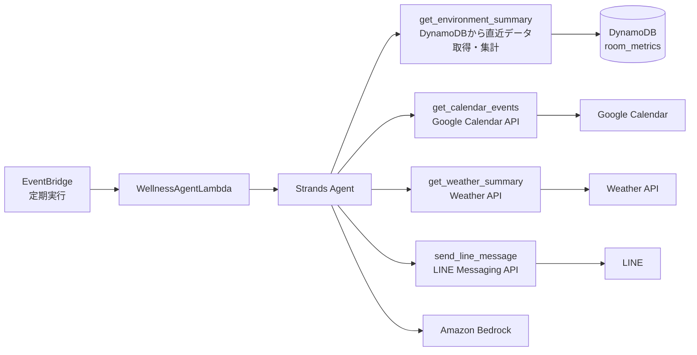

# Strands Agent化構想メモ

## Strands Agent化の方針
今まで作成してきたシステムを Strandsの「ツールを使うAgent化」にバージョンアップする  
Strands Agent化することにより、現在Lambda一本で運用していたシステムが、以下のように役割分担される  
- Lambda は起動担当
- Agent は判断担当
- ツールはデータ取得担当

### アーキテクチャイメージ

### 作業ステップ
Strands Agent化するにあたり、以下のステップで進ていく

### 既存のLambda関数をツール化
Strands Agentがツールを使ってセンサデータのサマリを取得し、それに基づく最終的な回答を生成させる
ツール化する関数の候補は以下
- get_environment_summary: 室内環境情報を取得
    - get_recent_sensor_data: デバイスから送られてきた室内環境データを取得
    - summarize_sensor_data: 室内環境データの前処理
    - classify_environment: 最新データから室内環境ステータスを分類
- send_line_message: LINEにメッセージを送信
- get_current_time_context: 現在時刻や時間帯を取得

### 外部コンテキスト追加
Agentに外部APIを使用した情報収集をさせる
- get_calendar_events: Googleカレンダーのスケジュールに沿ったタイミングや内容の回答を生成させる
- get_weather_summary: 天気予報の結果を取得

### コミュニケーションの双方向化
- ユーザがLINEで現在の状態や推奨アクションの問い合わせができるようにする

### AgentCore
- Strands Agent を AgentCore 上で動作させることで、実行基盤・認証・メモリ・観測性などを含む本番運用寄りの構成を体験する

---

## コード構成
今までの単一Lambda構成から、Strands Agent 向けに管理がしやすい構成に変更する
- core.py: 流用する既存関数
- tools.py: Strands から使うツール群
- agent.py: Agent 定義
- handler.py: Lambda エントリポイント
