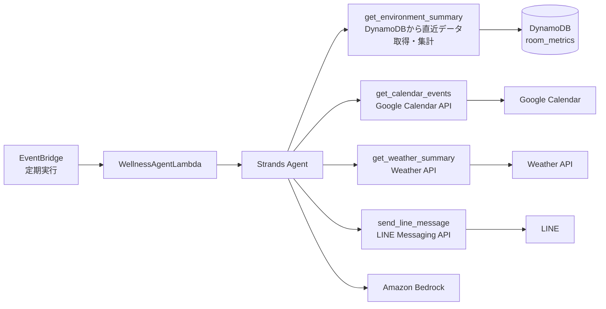
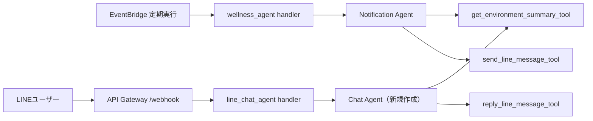

# Strands Agent化構想メモ

- [Strands Agent化構想メモ](#strands-agent化構想メモ)
- [Strands Agent化の方針](#strands-agent化の方針)
- [双方向コミュニケーション Agent 作成の方針](#双方向コミュニケーション-agent-作成の方針)
- [ツール追加 (カレンダー、天気予報、データグラフ化)](#ツール追加-カレンダー天気予報データグラフ化)

---

# Strands Agent化の方針
今まで作成してきたシステムを Strandsの「ツールを使うAgent化」にバージョンアップする  
Strands Agent化することにより、現在Lambda一本で運用していたシステムが、以下のように役割分担される  
- Lambda は起動担当
- Agent は判断担当
- ツールはデータ取得担当

---

## コード構成
今までの単一Lambda構成から、Strands Agent 向けに管理がしやすい構成に変更する
- core.py: 流用する既存関数
- tools.py: Strands から使うツール群
- agent.py: Agent 定義
- handler.py: Lambda エントリポイント

---

## アーキテクチャイメージ


---

## 作業ステップ
Strands Agent化するにあたり、以下のステップで進ていく

## 1. 既存のLambda関数をツール化
Strands Agentがツールを使ってセンサデータのサマリを取得し、それに基づく最終的な回答を生成させる
ツール化する関数の候補は以下
- get_environment_summary: 室内環境情報を取得
    - get_recent_sensor_data: デバイスから送られてきた室内環境データを取得
    - summarize_sensor_data: 室内環境データの前処理
    - classify_environment: 最新データから室内環境ステータスを分類
- send_line_message: LINEにメッセージを送信
- get_current_time_context: 現在時刻や時間帯を取得

## 2. 外部コンテキスト追加
Agentに外部APIを使用した情報収集をさせる
- get_calendar_events: Googleカレンダーのスケジュールに沿ったタイミングや内容の回答を生成させる
- get_weather_summary: 天気予報の結果を取得

## 3. コミュニケーションの双方向化
- ユーザがLINEで現在の状態や推奨アクションの問い合わせができるようにする

## 4. AgentCore
- Strands Agent を AgentCore 上で動作させることで、実行基盤・認証・メモリ・観測性などを含む本番運用寄りの構成を体験する

---

# 双方向コミュニケーション Agent 作成の方針
既に作成した Wellness Agent はそのままに、LINEチャット応答用の Agent を新たに作成する  
チャット応答用 Agent の役割は以下とする  
- ユーザーの質問内容を理解する
- 必要に応じて室内環境などの情報を取得する
- 質問に応じて自然な返答を作成する
- LINE に返信する

---

## 実装内容
- チャット Agent 専用の `agent.py`、`handler.py` を新規作成する  
  -  system prompt を Agent 単位で最適化できるため、定期通知用とチャット応答用で Agent を分ける  
- チャット応答用の `reply_line_message_tool()` を作成する
  - 既存の定期通知ツール `send_line_message_tool` は `POST /v2/bot/message/push`
  - Webhook への応答は `POST /v2/bot/message/reply` を使用する

---

## アーキテクチャイメージ


---

## 機能イメージ
まずは、ユーザーが LINE で送信した文章に対して、以下のパターンに回答できる状態を目指す  
- 今の部屋の状態を教えて  
👉 「室温23℃、湿度47%、CO2濃度は820ppmです。室内環境は良好です。」
- 換気した方がいい？  
👉 「CO2濃度が上昇傾向にあるため、換気を推奨します。」
- 仕事に集中する方法を教えて  
👉 「室温が27℃のため、換気かエアコンの使用をおすすめします。適度な運動と水分補給も意識しましょう。」

上記の動作検証後、Google カレンダー / 天気予報 などの外部情報も参照しながら、回答内容を強化していく  

---

# ツール追加 (カレンダー、天気予報、データグラフ化)
## ① カレンダー取得ツール
Agent にカレンダーを確認させ、スケジュールに合わせた回答をさせる  

取得できる情報は以下
- 次の予定3件
- 直近1時間以内の予定有無

### ツールの出力イメージ
```json
{
    "ok": True,
    "has_event_within_1h": True,
    "upcoming_events": [
        {
            "summary": "定例会議",
            "start": "2026-04-17T09:30:00+09:00",
            "end": "2026-04-17T10:00:00+09:00"
        },
        {
            "summary": "設計レビュー",
            "start": "2026-04-17T11:00:00+09:00",
            "end": "2026-04-17T11:30:00+09:00"
        },
        {
            "summary": "顧客MTG",
            "start": "2026-04-17T13:00:00+09:00",
            "end": "2026-04-17T14:00:00+09:00"
        }
    ]
}
```

### 通知イメージ
- 「30分後に会議があるので、今のうちに換気しましょう」
- 「しばらく予定がないので、5分ほど休憩してもよさそうです」
- 「午後から会議が続くため、無理をせずこまめな水分補給や運動を心がけましょう」

### 追加予定
- 忙しさレベル (busy_level) をツール出力に追加
  - light / normal / busy のような段階評価で Agent の回答に幅を持たせる

---

## ② 天気情報取得ツール
Agent に指定した日時の天気や気温・湿度を確認させ、  
換気・冷暖房・加湿/除湿・体調管理に関する回答をさせる

取得できる情報は以下
- 指定日時に近い時間の 天気
- 指定日時に近い時間の 外気温 / 湿度
- その日の 最高 / 最低 気温
- 季節情報
- 熱中症対策 が必要か
- 風邪 / 乾燥対策 が必要か

### ツールの出力イメージ
```json
{
    "ok": true,
    "weather": {
        "condition": "晴れ",
        "temperature_c": 35.2,
        "humidity": 58,
        "temp_max_c": 36.0,
        "temp_min_c": 24.0
    },
    "season_context": {
        "season": "summer",
        "month": 8
    },
    "health_alerts": {
        "heat_risk": true,
        "dryness_risk": false
    }
}
```

### 通知イメージ
- 「今日はかなり暑くなるため、換気よりも冷房の活用とこまめな水分補給を優先しましょう」
- 「空気が乾燥しているため、加湿や水分補給を意識するとよさそうです」
- 「外が過ごしやすい気温なので、換気や散歩をして気分転換するのもおすすめです」

---

## ③ グラフレポートツール
指定期間の室内環境データからグラフ画像を生成し、  
あわせて Agent にデータの傾向と推奨アクションを簡単にレポーティングさせる

このツールは chat_agent 専用 とし、ユーザーがチャットで推移を確認したいときに使用する  
（定期実行の wellness_agent では使用しない）  

取得・生成できる情報は以下  
-  指定期間の 温度 / 湿度 / CO2 の時系列グラフ画像 (署名付きURL)
-  グラフ生成に使用した時系列データの要約情報
-  Agent がコメント生成に使うデータの傾向情報

対応する期間は以下
- 1h : 直近1時間
- 1d : 直近1日
- 7d : 直近1週間

### ツールの出力イメージ
```json
{
  "ok": true,
  "period": "1d",
  "image_s3_key": "reports/2026-04-22/sensor_report_1d.png",
  "image_url": "https://signed-example-url",
  "summary": "過去1日の温度・湿度・CO2の推移グラフを生成しました。",
  "chart_data": {
    "sample_interval_minutes": 30,
    "summary_stats": {
      "co2_ppm": {
        "min": 520,
        "max": 1100,
        "avg": 760,
        "trend": "rising"
      },
      "temperature": {
        "min": 22.8,
        "max": 26.1,
        "avg": 24.5,
        "trend": "rising"
      },
      "humidity": {
        "min": 42.1,
        "max": 50.4,
        "avg": 46.8,
        "trend": "stable"
      }
    }
  }
}
```

### 通知イメージ
- 「今日の室内環境の推移をグラフで見せて」  
    👉 直近1日の温度 / 湿度 / CO2 グラフを画像で返す  
    👉 「今日は温度、湿度ともに過ごしやすい環境でした。CO2濃度は上昇傾向にあるため、寝る前に換気をするとよさそうです。」

---
